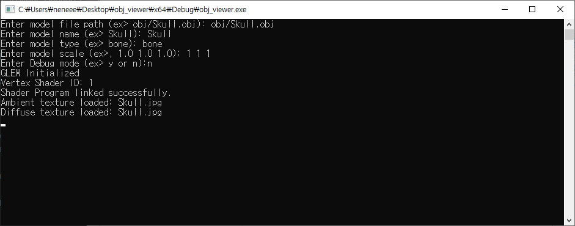
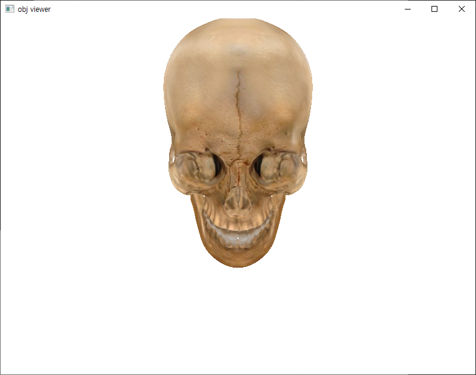

# obj viewer (opengl)

This program was created as part of a Computer Graphics course using OpenGL.

The program reads data from .obj files and supports loading corresponding .mtl files and texture images to render textured 3D models.

In cases where textures are not provided, the program is capable of rendering the model without textures, displaying only its geometry.

This program was created as part of a Computer Graphics course using OpenGL with C++.

You can download the program from the link below:
[Download OBJ Viewer](https://github.com/neneee0181/obj-viewer/releases/download/1.0.0/obj.viewer.zip)

password : 1234

If the .obj file is located in a folder, please enter the file name along with its path when prompted.

### How to Use

1. Download the program from the provided link
2. Ensure that your .obj file is ready in the desired folder.
   If the model uses a .mtl file or textures, make sure they are in the same folder as the .obj file.
3. Open the program and input the full path and name of the .obj file when prompted.

### key

- Use the arrow keys to rotate the model.
  Use the - (minus) and + (plus) keys to zoom out and zoom in, respectively.

Feel free to use this program as you wish!